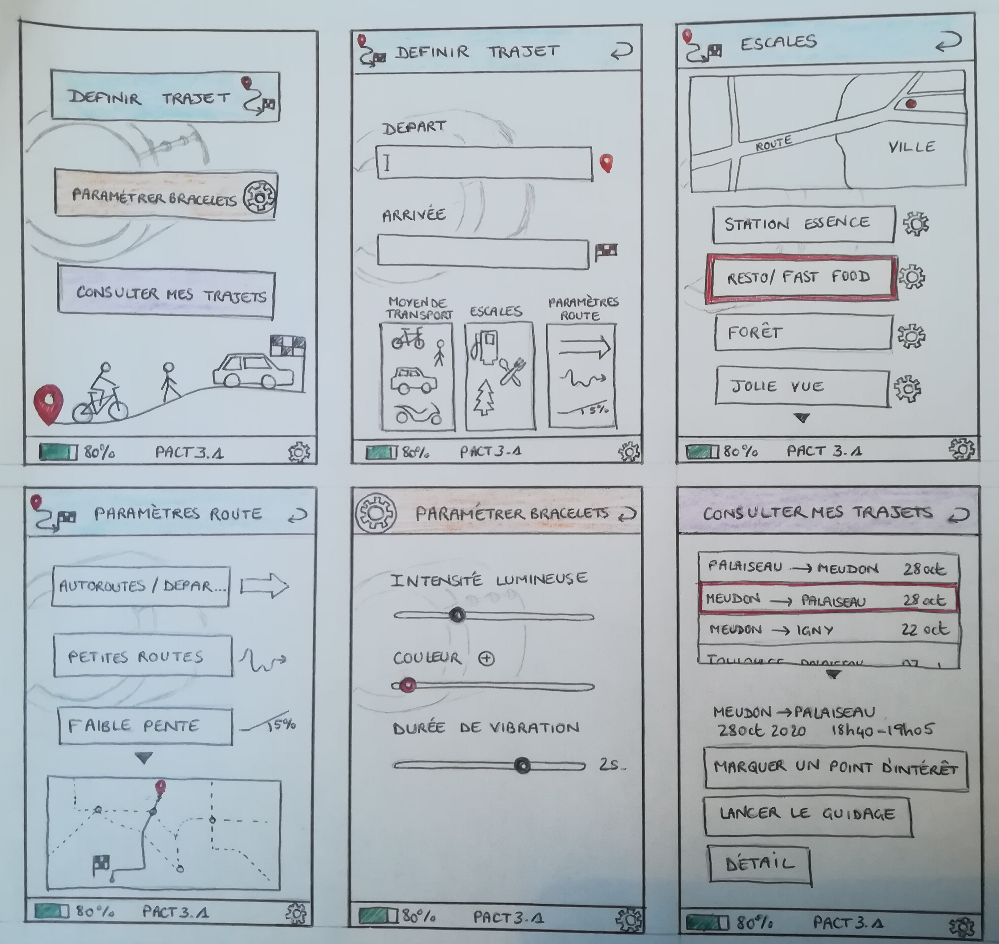

=== Interface utilisateur graphique

////
Il peut y avoir une ou plusieurs interfaces utilisateur (UI en anglais),
ou interface graphique, ou interface homme machine (IHM) : une interface
sur ordinateur et/ou une interface sur mobile ou tablette (Android),
selon le nombre d’appareils en jeu.

En lien avec un diagramme de séquence, une description simple de chaque
écran/page est nécessaire. Il est recommandé de faire des dessins, même
dessins au crayon photographiés ou scannés, car ce sont les meilleurs
supports de discussion : on appelle souvent ces dessins un
« storyboard ». Une description textuelle fait le lien entre tous les
éléments de l’IHM (ou des IHMs).
////

On a 2 interfaces, une interface entre l'utilisateur et le téléphone pour déterminer la route qu'il devrait prendre, et une autre entre l'utilisateur et les bracelets pour choisir le mode de fonctionnement du bracelet. Il s'agira dans ce dernier cas d'indicateurs à DEL plutôt que d'une interface graphique à proprement parler.

Voici l'interface graphique sur l'application Android:

La page d'accueil de l'application propose 3 activités principales:

. [.underline]#Définir un trajet# +
Il s'agit de l'activité de base, celle qui permet de dire d'où on vient, et là où on veut aller. De surcroît, l'utilisateur peut spécifier des conditions sur son trajet.

.. [.underline]#Moyen de transport# +
Comme le nom l'indique, cette option permet de spécifier le moyen de transport que l'on souhaite utiliser.

.. [.underline]#Escales# +
Permet d'agrémenter le trajet d'une pause déjeuner, d'un plein d'essence ou d'un lieu plus agréable à traverser.

.. [.underline]#Paramètres de route# +
Permet de spécifier le type de voies à privilégier, pour par exemple limiter la contrainte physique ou financière du trajet.

. [.underline]#Paramétrer les bracelets# +
Cette activité propose à l'utilisateur de personnaliser l'intensité lumineuse des DEL du bracelet, leur couleur, ainsi que les différents durées et motifs de vibration pour les instructions.

. [.underline]#Consulter mes trajets# +
Permet à l'utilisateur/trice d'étudier ses précédents trajets, pour lui permettre de marquer des lieux qu'il/elle a aimé ou considère comme étant importants, afin de les retrouver plus simplement plus tard. Il est aussi possible de relancer ce trajet, ce qui est utile s'il est récurrent.

De plus, toutes les pages de l'application permettent de surveiller le niveau de batterie des bracelets (en bas à gauche), ainsi que d'accéder aux options de langue de l'application (en bas à droite) et retourner à la page précédente (en haut à droite).

'''''