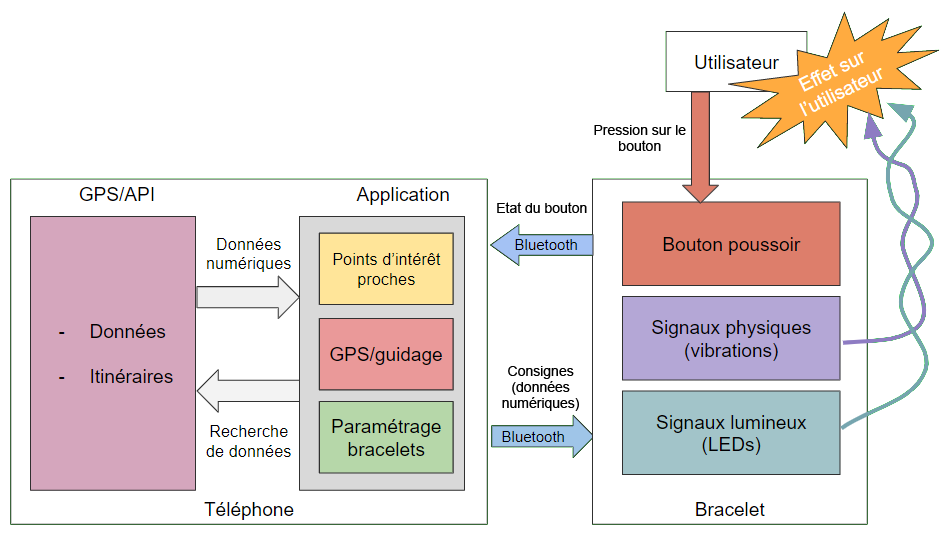

=== Schéma d’architecture

'''''

=== Bloc Téléphone

. [.underline]#Sous-bloc GPS/API (équivalent au bloc GMaps du schéma n°2)# +
C'est la partie qui récupère les données depuis les serveurs de Google Maps, et qui fournit les informations des alentours et les itinéraires conseillés.

. [.underline]#Sous-bloc Application# +
C'est tout ce que l'application Android gérera et permettra de faire :

- Trouver les lieux d'intérêt les plus proches
- Retransmettre les informations du sous-bloc GPS/API
- Paramétrer les bracelets : intensité des vibrations, fréquence etc...
- Revoir les trajets précédents 

'''''

=== Bloc Bracelet

Tout ce qu'un bracelet pourra retransmettre : vibrations, signaux lumineux; et recevoir : commandes vocales, mouvements.

. [.underline]#Sous-bloc Signaux Lumineux# +
Dispositifs DEL affichant le mode de travail de la navigation (trouver un parking, navigation).

. [.underline]#Sous-bloc Signaux Physiques# +
Elements du bracelet déclenchant et effectuant le motif vibratoire sélectionné.

'''''
