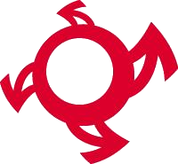

=== Description de la proposition
*_Note: 2 page max._*

////
_Décrire de façon détaillée votre projet : motivations de base/problèmes
constatés avant élaboration du projet, comment votre projet répond à ces
besoins. Ajouter une image ou une figure pour montrer à quoi cela
ressemble si besoin._
////

Au cours de nos premières séances, nous avons échangé entre nous pour découvrir nos intérêts communs.

D’un point de vue scientifique, notre groupe possède un pôle dominant physique :
les disciplines qui nous intéressent vont de la physique fondamentale au sens large à la
physique des matériaux. La problématique de la transition énergétique et notamment de
l’énergie nucléaire nous amène à nous questionner sur les thèmes de l’écologie,
mais aussi plus généralement de la cause animale et de l’égalité homme/femme. 
Le groupe possède également des intérêts sporadiques en mathématiques et en chimie.
La thématique de l’astrophysique se dégage aussi ; l’astrophoto nous rapproche ainsi du
pôle créatif du groupe.
Le groupe apprécie le dessin et la création musicale,
la majorité du groupe joue d’ailleurs d’un instrument. L’informatique et plus
particulièrement le codage est un intérêt commun rassemblant le groupe, avec une emphase
particulière sur la robotique et les systèmes embarqués. Ainsi, le thème sociétal du transhumanisme
se dégage à travers des questionnements sur les exosquelettes et les modifications corporelles.
Cela nous amène au dernier pôle de notre groupe – le pôle sportif. En dehors des nombreux 
sports que nous pratiquons, certains s’intéressent aussi au e-sport, autant de disciplines
qui peuvent être impactées par la robotique et l’informatique.

Suite à cela, nous avons cherché des problématiques actuelles qui s'inscriraient dans le sujet du PACT de cette année,
soit *"Le numérique au service de l'humain"*. Puis nous avons également cherché des solutions techniques pour y répondre.
L'un des principaux problèmes que nous avons rencontré durant toute cette période de travail (PAN1)
a été notre méconnaissance des technologies et possibilités techniques qui nous ont empêché de nous projeter
dans nos différents sujets. Malgré cela, nous avons constitué la liste suivante des problématiques intéressantes à nos yeux:

* Enrichir la perception du monde chez l'Homme par le ressenti de grandeurs imperceptibles.
	
	** Solution : système de conversion récupérant des données issues de phénomènes extérieurs
	à l'homme (rayonnements infrarouges/ultraviolets, sons inaudibles, agitation d’une foule…)
	et les retranscrivant en signal compréhensible pour un (ou des) sens humain(s) (vibration,
	image, son audible par l’homme…)
	
* Pallier la perte d’imagination due au numérique, à l’aide du numérique 
	
	** Solution : une application poussant l'utilisateur à s'ouvrir à de nouvelles activités ou à pratiquer
	une activité physique (sous forme de jeu, défis à réaliser...). 
	
* Améliorer la vision de l’environnement proche de l’humain pour son confort et sa sécurité 
	
	** Solution 1 : une caméra de recul spécialement adaptée à l’humain dont on pourrait consulter le
	champ de vision élargi sur un objet tiers comme notre smartphone (intéressant du point de vue
	de la discrétion et de la prévention des agressions)
	
	** Solution 2 : un casque lié à une caméra nous permettant d’avoir une vision
	panoramique de nos alentours. 

Après avoir débatu sur nos différents sujets, nous avons retenu le premier problème lié à la perception.
Ainsi, notre principale motivation pour le PACT était de réaliser un outil technologique 
se basant sur la perception de notre monde, qui se focaliserait sur un autre sens que la vue (trop utilisée à notre goût)
et qui permettrait de se déplacer différemment dans un environnement urbain. Notre PACT
devait être à la fois utile, pratique et amusant, mais ayant un usage quotidien (extension de l'homme).

Suite à des discussions avec notre tuteur et Stephane Safin, notre projet à évolué.
Il consiste donc en un guidage personnalisé privilégiant le toucher pour tous les usagers de la route,
à l'aide de bracelets donnant les informations de navigation grâce à des vibrations et des LEDs.
Ces bracelets seront paramétrables via une application sur le téléphone mais en aucun cas lors du guidage
l'utilisateur ne sera amené à regarder son téléphone. L'utilisateur configure son trajet sur l'application en précisant
son mode de transport (et d'éventuelles options supplémentaires), l'application récupère le trajet grâce à une API Google Maps et convertit
ces informations en "ordres" de vibrations envoyés ensuite aux bracelets. A la fin de son trajet l'utilisateur est 
notifié de son arrivée grâce à une vibration particulière et un message sur son téléphone (de confirmation).
Il peut alors décider d'être guidé à un point remarquable proche (ex: parking, station essence...) grâce à un bouton sur
le bracelet ou une commande vocale (à déterminer suite à des tests/sondage).

Dans un premier temps nous souhaitons nous concentrer sur les piétons, les cyclistes et les automobilistes.
Mais nous pensons qu'ils pourraient également être utiles pour les personnes se déplaçant en roller, skate, trottinette...
Cependant, pour ces modes de déplacement incluant davantage d'effort physique et de vibrations (dues au mode de transport)
pour l'utilisateur, il sera nécessaire de faire des tests pour vérifier si les bracelets sont utilisables dans ce contexte.

Nous avons privilégié les vibrations accompagnées de quelques informations lumineuses (voyants sur les bracelets
indiquant des modes particuliers
par exemple) car nous sommes convaincus que dans notre société, la vue est sur-sollicitée. Davantage d'informations
visuelles entraînent une distraction, alors que lorsque l'on se déplace en ville nous avons besoin de toute notre
attention. Selon nous, le sens de l'ouïe n'est pas non plus optimal car il suffit que notre environnement
soit bruyant pour que l'on soit déconcentré de notre GPS et que l'on loupe ses instructions. De plus, recevoir des instructions
vocales concernant des distances n'est pas très précis et n'aide pas à bien se repérer (qui sait ce que représente la distance "200m" à vue d'oeil sachant que la perception de distance évolue avec la vitesse à laquelle nous nous déplaçons?). Ainsi, nous pensons pouvoir améliorer la sécurité des usagers de la route grâce à notre dispositif.

Notre projet répond à la fois à la problématique du "numérique rendant service à l'humain" en améliorant la sécurité de l'utilisateur mais également en pouvant venir en aide à un public handicapé (malvoyant ou malentendant). De surcroît, il répond également au problème que nous avons
sélectionné c'est-à-dire la perception de notre environnement par un autre sens que la vision, pour nous soulager dans notre quotidien.

Enfin, nous avons choisi comme nom de projet "Onion Wizz" en rapport:

* à l'oignon qui se compose de plusieurs couches comme les différentes couches de réseaux de transport
dans l'espace urbain. En effet, les bracelets sont censés être utilisables dans n'importe quel mode de transport.

* wizz comme les vibrations produites par certains réseaux sociaux. Ce sont ces mêmes vibrations qui guident l'utilisateur via les bracelets.

Nous avons ainsi produit deux (ébauches) de logos:

* un premier comprenant le nom complet du dispositif, pouvant être ajouté sur des documents ou présentations:

* un deuxième, plus petit, pouvant être mis sur les bracelets par exemple:

////
=== Exemples d'utilisation d'AsciiDoc

_Ici quelques exemples de syntaxe AsciiDoc pour ajouter des équations, des images, des listes..._

_Ces exemples *ne doivent pas* être conservé dans la version finale du rapport._

==== Exemples d'équations

* Inline math: latexmath:[\int_{-\infty}^\infty g(x) dx]
Pour ajouter une équation ou un symbole mathématique dans le corps du texte.

* Block math pour avoir une équation centrée au milieu de la page:

[latexmath]
++++
\int_{-\infty}^\infty g(x) dx
++++

==== Exemples d'images

* Ceci est un exemple d'image:

* L'image peut être redimensionnée et avoir un titre:

.Le logo du projet

* Pour le rapport, les images peuvent être aux formats jpeg, png ou même *svg*:

image::../images/pact.svg[un autre logo pact,300,300]

* Les images peuvent aussi être mises dans le corps du texte par exemple .

==== Exemples de code

On peut ajouter des blocs de code formatés en précisant le langage utilisé:

[source,python]
----
def func(i):
   x = 3 + i
   return x

for i in range(10):
   print "---> ", func(i)
----

[source,java]
----
class foo {
   Integer i;
   String s;
}
----

==== Exemples de listes

* AAAA
** aaaaa
*** axaxax
** bbbbb
** ccccc
* BBBB
* CCCC

'''''

.  AAAA
..  aaaa
..  bbbb
.  BBBB
.  CCCC

'''''

.Liste des tâches à faire:
*  [ ] Pas encore fait
** [ ] étape X
** [x] étape Y (a démarré en avance)
** [ ] étape Z
*  [x] Complètement finit
** [x] étape Q
** [x] étape R
** [x] étape `finale` E=mc^2^

'''''

.Liste descriptive:

Étape 1::: Faire A, B, C…
Étape 2::: Faire X, Y, Z…
Étape 3::: Faire W, et c'est fini…
////

